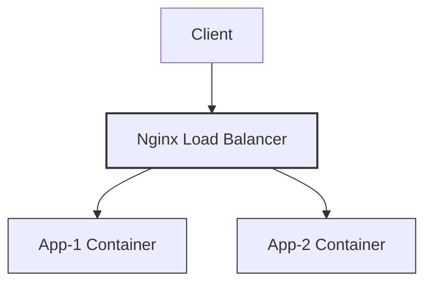

# Task1: Load Balancing menggunakan Nginx

## Deskripsi
Task ini bertujuan untuk mengimplementasikan konsep load balancing sebagai bagian dari sistem terdistribusi. Nginx digunakan sebagai load balancer untuk mendistribusikan request ke beberapa backend service yang berjalan pada container Docker.

## Konsep Dasar
Load balancing adalah teknik untuk mendistribusikan beban kerja ke beberapa server agar:
- Meningkatkan ketersediaan layanan
- Menghindari beban berlebih pada satu server
- Meningkatkan performa sistem

Dalam implementasi ini:
- Nginx bertindak sebagai reverse proxy dan load balancer
- Dua backend application berjalan pada container terpisah
- Semua service berjalan dalam satu jaringan virtual Docker

## Arsitektur Sistem   

## Implementasi  
Implementasi dilakukan menggunakan Docker Compose untuk menjalankan beberapa container sekaligus, yaitu:
- 1 container Nginx
- 2 container backend application

Link implementasi: [langkah-task1.md](langkah-task1.md)

Nginx dikonfigurasi menggunakan metode default (round-robin) untuk mendistribusikan request ke backend.

## Hasil
Aplikasi dapat diakses melalui:  
http://localhost:8081/  

Ketika halaman di-refresh beberapa kali, respon yang diterima berasal dari backend container yang berbeda, yang ditunjukkan melalui hostname container. Hal ini membuktikan bahwa proses load balancing berjalan dengan baik.  

